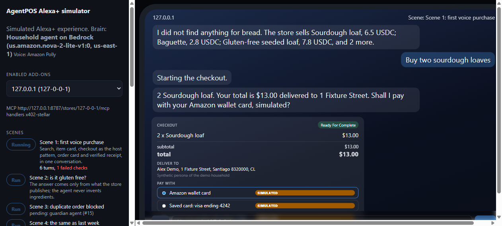
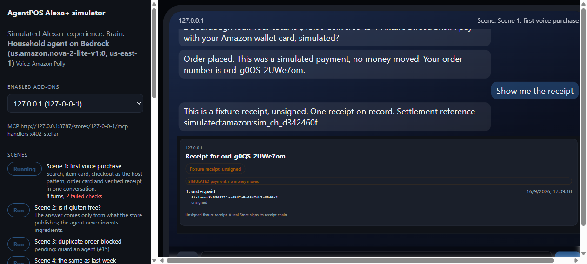

# AgentPOS for Alexa+

**Turn any existing online store into an Alexa+ add-on with in-conversation checkout: MCP
server, UCP checkout, merchant policies and verifiable receipts, with the store as merchant
of record and no marketplace in between. The merchant chooses how to get paid.**

Alexa+ for Builders is for Priceline. AgentPOS is for the corner store.

> Status: in development for the Amazon "Build, Ship, Shape" Developer Hackathon 2026
> (Alexa+ track, AWS Builder and Open Source mini challenges). Public from the first commit.

## What this repository is

Amazon defines an Alexa+ add-on as "the bridge you deploy" between an MCP server and Alexa+.
This repository is that bridge for stores that run [AgentPOS](https://agentposhq.com): it sits
in front of any AgentPOS store, consumes the store's public surfaces (MCP, REST API,
`/.well-known/ucp`, checkout) and exposes the full Alexa+ contract:

- an **MCP server** (Streamable HTTP, spec 2025-11-25) with voice-ready item data and **MCP
  Apps** (product carousel, item card, order card, receipt card with a verified badge);
- the **UCP-compatible checkout** Alexa+ documents: `/checkout-sessions` create, get, update,
  complete and cancel, OAuth 2.0 bearer auth, 24-hour idempotency, 6-hour sessions, business
  errors as `messages[]`;
- **payment rails** behind one interface, chosen by the merchant, never by us:
  1. **the merchant's own PSP** (Stripe, in test mode for the demo): the charge lands in the
     store's dashboard with the store as merchant of record;
  2. **Amazon Wallet** (`com.amazon.payments.network_token`, `stored_payment_method`):
     implemented against the published contract and exercised with a clearly labeled simulated
     PSP while the Alexa+ program is in preview;
  3. **USDC on Stellar** (`org.x402.stellar`) when the agent brings a wallet: real settlement
     through an open x402 facilitator;
- **merchant-side agents** on Amazon Bedrock AgentCore with Strands: onboarding (turns a URL
  into a voice-ready catalog and proposed policies; a human confirms), catalog (answers what a
  flat catalog cannot) and policy guardian (adds context to the store's deterministic policy
  and can hand the order to a human);
- a **simulated Alexa+ client** (`apps/simulator`), the official alternative path for the
  track: an Echo Show style web app, voice in and out, whose agentic client runs on Bedrock
  and drives the bridge end to end.

The store side (catalog, quotes, merchant policies, human approval queue, signed receipt
chain, agent identity, settlement, WooCommerce order creation only after settlement) is
AgentPOS itself. This bridge runs today against the public demo store at
`https://demo.agentposhq.com` and needs nothing else.

## Layout

```
packages/store-client   typed client for the public surfaces of an AgentPOS store (discovery, REST, x402 challenge)
packages/fixture-store  test double of an AgentPOS Store: the real OpenAPI shapes, a bakery with physical goods, recorded demo responses
packages/bridge         the add-on: MCP server for Alexa+, MCP Apps views, UCP checkout sessions, payment rails, UCP profile
packages/agents         onboarding, catalog and policy guardian agents (Strands on AgentCore, Bedrock)
apps/simulator          simulated Alexa+ experience (Echo Show frame, host checkout pattern, inspection summary)
docs/                   strategy, submission draft, architecture, Alexa+ MCP design rules, security, AWS integration, usage events, friction log
```

## Try it

The hosted playground runs on Amazon ECS Express Mode in us-east-1:

| What | URL |
| --- | --- |
| Simulator (Echo Show frame, Scenes 1 to 5) | https://ag-7e67cc0a076f402c969b806381d31b43.ecs.us-east-1.on.aws/ |
| Merchant console (onboarding) | https://ag-7e67cc0a076f402c969b806381d31b43.ecs.us-east-1.on.aws/#/merchant |
| Bridge (MCP for Alexa+, UCP checkout, `/health`) | https://ag-849fad36923d46a9b1a7ecf0f5d3fcd7.ecs.us-east-1.on.aws |
| Fixture bakery Store (`/.well-known/ucp`) | https://ag-8e0161c11f574824accc60bc26c8d2f4.ecs.us-east-1.on.aws |

Payments there are the simulated Amazon handlers, labeled SIMULATED: no money moves. Visitors
shop as the Demo household, whose mandate allows simulated or Test mode rails only and up to
US$50 per order (ADR-0002). Their purchases count as third-party purchases, shown in the panel
and at the Bridge's `/stats`; our own Scene runs do not. Merchants and shoppers can join the
waitlist from the panel. Turns are capped per visitor and per hour to protect the demo's model
budget.

## Run

Requirements: Node >= 22.13 (uses `node:sqlite` unflagged, no native dependencies), pnpm 11+.

```bash
pnpm install
pnpm typecheck
pnpm test
pnpm dev:fixture-store # a bakery-shaped test double of an AgentPOS Store on :8790 (optional)
pnpm dev:bridge        # registers AGENTPOS_STORE_URL (default: the public demo store) and listens on :8787
pnpm dev:simulator     # the simulated Alexa+ experience on http://127.0.0.1:8788 (builds its web app first)
```

To run the bridge against the bakery instead of the public demo store, set
`AGENTPOS_STORE_URL=http://127.0.0.1:8790`. The simulator needs the same
`BRIDGE_BEARER_TOKEN` as the bridge: set it in `.env` for both, or copy the one-run token the
bridge prints at boot when the variable is missing.

Environment variables are listed in `.env.example`; `bash scripts/setup-wizard.sh` (Git Bash
on Windows) walks a human through the ones only a human can create (AWS keys for Bedrock,
model access, the Stripe test publishable key) and writes them to `.env`. Every service loads
the nearest `.env` at boot and keeps its data under `.data/` at the workspace root, whatever
folder it was started from. `pnpm bedrock:check` lists the models the account can invoke and
makes one minimal call per configured model, never printing credentials. Nothing in this
repository ever holds a merchant's or a household's private key or PSP secret.

```bash
curl http://127.0.0.1:8787/health
curl http://127.0.0.1:8787/stores/demo-agentposhq-com/.well-known/ucp
```

## The bridge

The bridge is multi-tenant: every Store it serves lives under `/stores/{slug}/`, and the
first one is registered at boot from `AGENTPOS_STORE_URL`. Every response carries a
`Request-Id` that is the trace id across the bridge's JSON logs, the Store request and the
settlement.

**MCP for Alexa+** at `/stores/{slug}/mcp`: Streamable HTTP, spec 2025-11-25, bearer auth.
Seven tools, one intent each: `search_items`, `get_item`, `ask_catalog`, `get_policies`, `start_checkout`,
`get_order`, `get_receipt`. Every result speaks first (a short text block) and carries
structured content with prices as integer minor units; every failure is a typed error, never
an empty result. Four tools carry an MCP Apps view (carousel, item card, order card, receipt
card) that the bridge serves as a `ui://` resource: one self-contained HTML file each, built
from `packages/bridge/apps/` with `pnpm --filter @agentpos-alexa/bridge build:apps` and
committed, so nothing needs building to run.

**UCP checkout** at `/stores/{slug}/checkout-sessions` (create, get, update, complete,
cancel), as Alexa+ documents it. Sessions are priced from the Store's catalog, quoted by the
Store once a delivery address exists, and completed only when a payment rail reports
settlement with a reference. Idempotency-Key is required on every state change and replayed
for 24 hours; every response is validated in tests against the vendored official UCP schemas
(`packages/bridge/vendor/ucp`). Platforms get bearer tokens from `POST /oauth/token` with
client credentials (`BRIDGE_OAUTH_CLIENT_ID` and `BRIDGE_OAUTH_CLIENT_SECRET`).

**Usage events**: every tool call, rail call and model call lands in `usage_events`
(`docs/USAGE-EVENTS.md`); `pnpm --filter @agentpos-alexa/bridge usage:export` writes the CSV
and `--summary` the totals behind `docs/COSTS.md`.

## The simulator

An Echo Show frame with the four display modes Amazon documents (inline, fullscreen,
voice-only, hydrated), the Enabled add-ons the bridge serves, voice or text input, and an
inspection summary per turn (`.data/inspection-summary.json`) that checks what Amazon's
guide asks for: voice text first, three to five carousel items, first item within 500 ms,
typed errors. Until the Household agent lands, a scripted router with no model maps the text
to one Bridge tool, and the interface says so.

Voice out is Amazon Polly (generative voices, cached per phrase under `.data/polly-cache`)
whenever the AWS credentials allow it, and the browser's own voice otherwise; the panel says
which one is speaking. The Scenes panel plays the scripted demo runs step by step with the
real brain and a real Bridge, tagging every turn in the inspection summary.

Checkout is the host's own pattern, as it is in Alexa+: when the customer confirms what to
buy, the simulator opens a UCP checkout session on the bridge, fills the Demo household's
synthetic address, shows the store's quote with the payment handlers the session accepts
(the Amazon handlers, labeled SIMULATED), and completes with the chosen one. The order card
and the receipt card that follow are the bridge's own MCP Apps views.

The Merchant console (`#/merchant` in the simulator app) is the onboarding: paste a Store
URL, the onboarding agent scans the catalog and drafts the Voice overlay (spoken name, one
sentence, synonyms per item) and three voice policies; the Merchant edits and confirms;
nothing is published before that click. Every stage lands in `usage_events`, and the timer
shown ("URL to first voice purchase") is read back from those rows. Published spoken names
replace the Store's titles on the speaker and synonyms reach the catalog agent; a line whose
item changed in the Store goes stale and the Store's own words return until the Merchant
confirms again. Scene 5 plays it: scan, wait for the Merchant, then the first purchase.

The catalog agent answers the question the item card cannot: "is the seeded loaf gluten
free?", "does it contain nuts?", "is it organic?". It reads only what the store publishes
(attributes, description, the Voice overlay once onboarding lands) and a deterministic
answerer runs first; the fast model (Nova 2 Lite) words the answer and can never upgrade an
unpublished fact to a published one. When the store has not published the fact, it says so.
Scene 2 plays the three questions. Tool: `ask_catalog`.

The policy guardian sits inside `complete`: when this household orders the same lines it
ordered within the last seven days, the Bridge does not settle. It answers with one spoken
sentence (Claude Sonnet 4.6 on Bedrock writes it when credentials resolve; a fixed sentence
otherwise), the checkout stays open with the same quote, and the button reads "Yes, order it
again". Scene 3 plays exactly that. The rule is deterministic and runs first; the model only
words the question, and the guardian never sees the buyer's email, only a hash.


Scene 1 on the real Household agent (Amazon Bedrock, Nova 2 Lite) with Amazon Polly speaking:





## Principles we do not bend

- The store is merchant of record. No commission, no custody, no marketplace.
- The merchant chooses the rail. The bridge never holds a PSP key; the store executes the charge.
- Nothing scanned is published without human confirmation.
- No order is created without settled payment and a settlement reference.
- Every protocol detail (MCP, UCP, x402) lives behind an adapter and is pinned to a version.
- Amounts are integers in minor units. Never floats for money.
- Cryptography only through official SDKs (`@x402/*`, `@stellar/stellar-sdk`, MCP SDK).
- Simulated means labeled: in code, logs, responses and UI, and never switchable to a real PSP by configuration.

## Strategy

Why the rails are ordered this way, why the simulator comes second and how impact is
measured: `docs/STRATEGY.md`.

## AWS integration

See `docs/AWS-INTEGRATION.md` (services, why each, where in the code).

## Security by design

See `docs/SECURITY.md`.

## Friction log

Written while building, one entry per obstacle with Amazon or AWS tooling:
`docs/FRICTION-LOG.md`.

## License

Apache-2.0. Copyright 2026 NovaCorpAI SpA.
